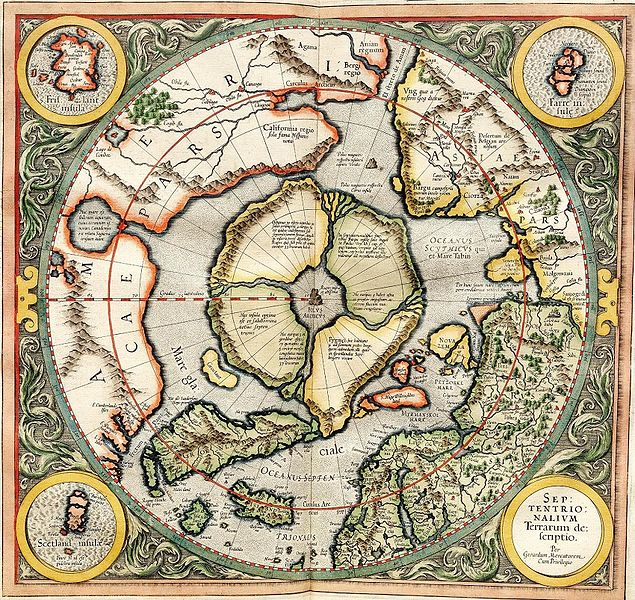

On olemassa kolmas henkinen koti, välipaikka, auringon ja tiibetiläisen Sambhalan välissä. Viittaukset tähän kolmanteen ja kaikkein pyhään paikkaan maan päällä löytyy kaikista suurista eksoteerisista uskonnoista, ja tämä paikka on huipulla siinä, mikä on uskonnossa Hindujen Puranoissa kutsutaan Sveta-dvipaksi, Meru- tai Sumeruvuoreksi. Se on maapallon pohjoisnapa, eikä sitä ole valittu sen maantieteellisten ominaisuuksien vuoksi, jos sellaisia on, vaan sen tähtitieteellisen sijainnin vuoksi. Tällä alueella H.P.B. kirjoitti Salaisessa opissa (II, 6): Tämän "pyhän maan" ... on todettu koskaan jakaneen muiden maanosien kohtaloa, koska se on... ainoa, jonka kohtalona on kestää Manvantaran alusta loppuun koko Manvantaran ajan. jokaisella kierroksella. Se on ensimmäisen ihmisen kehto ja viimeisen jumalallisen kuolevaisen asuinpaikka, joka on valittu Sishta ihmiskunnan tulevalle siemenelle. Tästä salaperäisestä ja pyhästä maasta voidaan sanoa hyvin vähän, paitsi ehkä eräässä kommentaarissa olevan runollisen ilmauksen mukaan, että "napatähti valvoo sitä SUUREN HENGITYKSEN aamunkoitteesta  'päivän' hämärän loppuun saakka".
Lähde: [Fountain-Source of Occultism, G. de Purucker](https://ia601001.us.archive.org/5/items/fountainsourceofoccultism/Fountain%20Source%20of%20Occultism.pdf)

Tässä on Mercatorin kirje John Deelle, joka on muistaakseni E. G. R. Taylorin vuonna 1956 tekemästä käännöksestä:
Lainaus
"Neljän maan keskellä on pyörre, johon tyhjentyvät nämä neljä Pohjoisen jakavaa merta. Ja vesi syöksyy ympäri ja laskeutuu maahan aivan kuin sitä kaadettaisiin suodatinsuppilon läpi. Se on neljä astetta leveä napa-alueen jokaisella puolella, eli kahdeksan astetta korkeammalla. Paitsi että aivan navan alapuolella, meren keskellä on paljas kallio. Sen ympärysmitta on melkein 33 ranskalaista mailia, ja se on kokonaan magneettista kiveä. Ja se on yhtä korkea kuin pilvet, sanoi pappi, joka oli saanut astrolabion tältä minorilaiselta vastineeksi testamentista. Ja Minoriitti oli itse kuullut, että sen ympäri voi nähdä mereltä käsin, ja että se on musta ja kiiltävä. Eikä siellä kasva mitään, sillä siellä ei ole kuin kourallinen multaa."
Lähde: [Jason Colavito](https://www.jasoncolavito.com/blog/albertin-de-virgas-1414-map-of-america)